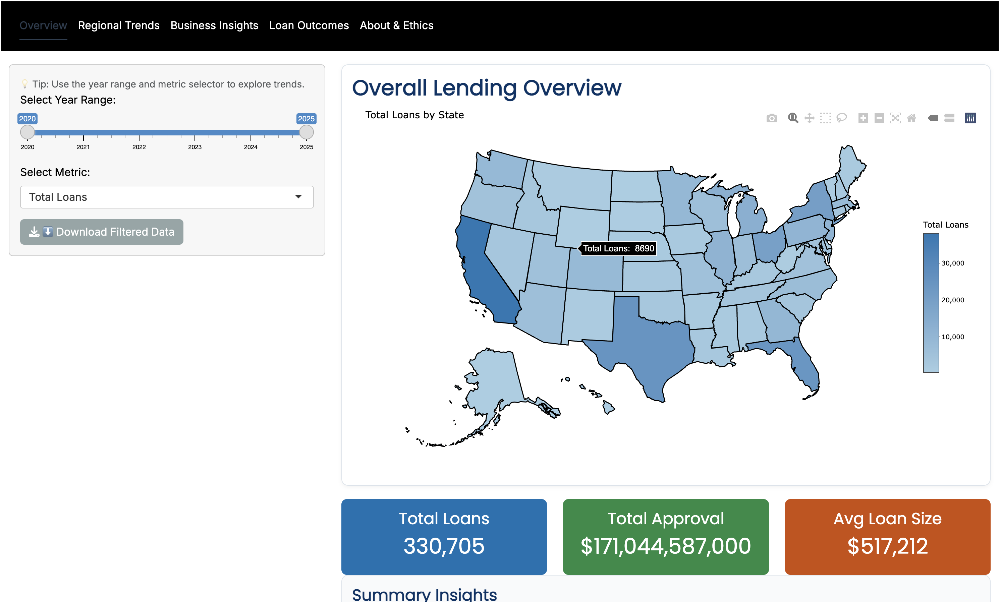
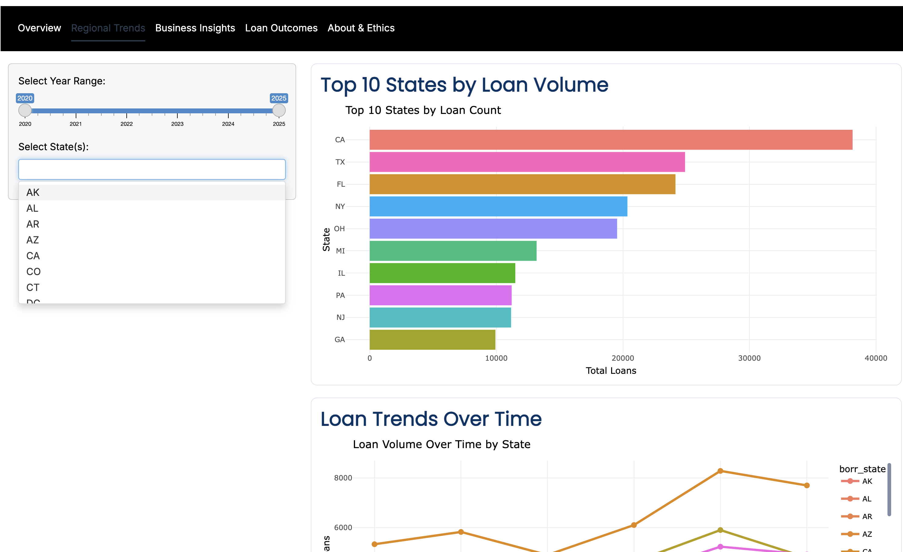
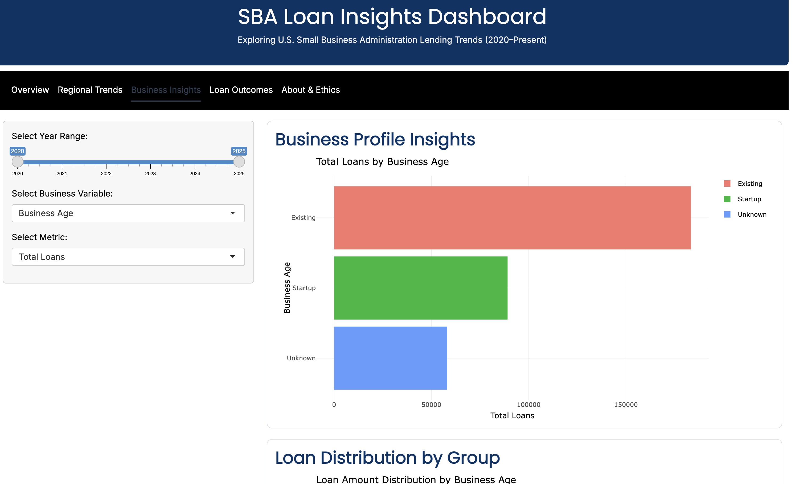
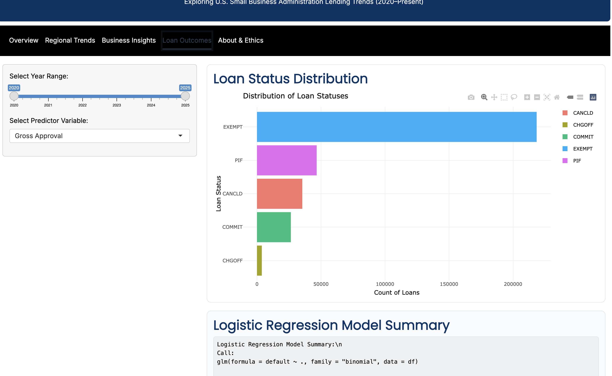

## 1. Use Case

### 1.1 Context

Small businesses form the backbone of the U.S. economy but often struggle to secure credit, especially after economic shocks like the COVID-19 pandemic.\
The U.S. Small Business Administration (SBA) 7(a) loan program helps fill this gap by guaranteeing loans made by private lenders.

The **SBA Loan Insights Dashboard** enables users to interactively explore how SBA lending has changed across **states, industries, and business types** from **FY 2020 to Present**.\
It supports exploratory and statistical analysis of national lending patterns and loan default risk.

### 1.2 Intended User

The dashboard is designed for **policy analysts**, **researchers**, and **economic development professionals** who want to:

-   Examine which states and industries received the highest SBA support\
-   Compare startup vs. existing business lending\
-   Identify predictors of loan default\
-   Create visual summaries for reports or policy discussions

### 1.3 Example Questions

1.  Which U.S. states and industries received the largest SBA 7(a) loan support since 2020?\
2.  Do startups receive smaller loans than existing firms?\
3.  Which loan or borrower characteristics are linked to defaults?\
4.  Are collateral requirements or loan terms associated with better repayment outcomes?\

## 2. Required Packages

The app uses open-source R packages recommended in **DATA 613**:

| Package   | Purpose                              | Version |
|:----------|:-------------------------------------|:-------:|
| tidyverse | Data wrangling and plotting          |  ≥ 2.0  |
| janitor   | Clean and standardize variable names |  ≥ 2.2  |
| lubridate | Parse and manipulate dates           |  ≥ 1.9  |
| plotly    | Interactive visualizations           | ≥ 4.10  |
| usmap     | U.S. choropleth maps                 |  ≥ 0.7  |
| DT        | Interactive data tables              | ≥ 0.32  |
| bslib     | Shiny theming (Flatly)               |  ≥ 0.7  |
| scales    | Formatting numbers and currency      |  ≥ 1.3  |
| shiny     | Interactive dashboard framework      |  ≥ 1.9  |

All packages load automatically in `app.R`.\

## 3. Data Source and Structure

### 3.1 Data Origin

-   **Dataset:** FOIA – SBA 7(a) Loan Data (FY 2020–Present)\
-   **Source:** [data.sba.gov](https://data.sba.gov)\
-   **Updated:** June 30, 2025\
-   **Volume:** 330,705 observations × 43 variables\
-   **Format:** CSV → converted to `.rds` for faster loading

### 3.2 Cleaning and Preparation

Data cleaning was performed in `R_scripts/data_cleaning.R` following tidyverse conventions:

\- Standardized column names using `janitor::clean_names()`

\- Converted date formats with `lubridate::mdy()`

\- Derived new variables such as `year` and `default`

\- Removed missing and extreme outlier values for `gross_approval`

### 3.3 Key Fields

| **Category** | **Variables** | **Description** |
|:---|:---|:---|
| Borrower Info | `borr_state`, `borr_city` | Business location |
| Loan Details | `gross_approval`, `termin_months`, `delivery_method`, `collateral_ind` | Structure and size |
| Business Profile | `business_type`, `business_age`, `jobs_supported` | Business classification |
| Loan Outcomes | `loan_status`, `default`, `gross_chargeoff_amount` | Repayment and defaults |
| Temporal | `as_of_date`, `year` | Report period |

## 4. Exploratory Data Analysis (EDA)

### 4.1 Overview Tab

Users begin by selecting a **year range (2020–2025)** and **metric** (Total Loans, Average Loan Size, or Total Approval Amount).\
The interactive U.S. map shades states according to the selected metric, with hover tooltips showing exact values.\
Below the map, a summary box displays **key performance indicators (KPIs)** for the chosen period.

{#fig-overview fig-align="center"}

@fig-overview*.* *Overview tab showing total SBA loans by state.*

------------------------------------------------------------------------

### 4.2 Regional Trends Tab

Users can filter by specific **states** and **year ranges** to explore geographic patterns.\
Outputs include:

-   **Top 10 States by Loan Count** (bar chart)\
-   **Loan Volume Over Time** (line chart)\
-   **Interactive Data Table** summarizing totals and averages

{#fig-regional fig-align="center"}

@fig-regional*.* *Regional Trends tab visualizing state loan volume and trends over time.*

------------------------------------------------------------------------

### 4.3 Business Insights Tab

The **Business Insights** tab explores lending patterns by **business type**, **age**, and **industry (NAICS)**.\
Users toggle between *Total Loans* and *Average Loan Size* to compare across firm categories.

{#fig-business fig-align="center"}

@fig-business*.* *Comparison of average loan size by business age.*

## 5. Statistical Analysis

### 5.1 Loan Outcomes Tab

### (Note : selecting multiple predictors will take a min or so to load the model results)

The **Loan Outcomes** tab implements a logistic regression to estimate loan default probability.\
Users can select multipile or one predictor/ s (e.g., `gross_approval`, `termin_months`, `business_age`, or `collateral_ind`) to test its effect on default risk.

**Model Formula**

```{r, eval=FALSE}
glm(default ~ gross_approval + termin_months + business_age +
    collateral_ind + delivery_method + borr_state,
    data = sba_clean,
    family = "binomial")
```

This model predicts whether a loan is charged off (default = 1) or paid in full (default = 0).

{fig-align="center"}

@fig-outcomes*.* *Loan Outcomes tab visualizing distribution of loan statuses and gives out the model regression summary.*

------------------------------------------------------------------------

## 6. References

1.  Galli-Debicella, M. (2020). *The efficacy of SBA loans on small firm survival rates.* *Journal of Entrepreneurship & Development.*\
2.  Lee, S., Ryu, K., & Park, H. (2023). *Regional redistribution effects of SBA-guaranteed loans.* *Economic Inquiry.*\
3.  Craig, B., Rutherford, L., & Milliken, F. (2019). *SBA lending and local employment growth.* *Federal Reserve Working Paper Series.*

## 7. Individual Contributions

Author: **Esha Teware**\
Course: DATA 613 – Introduction to Data Science

Responsibilities: - Data acquisition, cleaning, and transformation (`data_cleaning.R`)\
- Exploratory analysis and visualization design\
- Shiny UI and server development\
- Logistic regression modeling and interpretation\
- Ethical review and vignette writing

## 8. Readability and Summary

This vignette adheres to **DATA 613 reproducibility standards**:

-   Structured sections and numbered headings\
-   Figures captioned and introduced with cross-references\
-   Consistent tidyverse coding and styling\
-   Concise, professional writing and proper grammar\
-   Ethical and transparent presentation

### Summary

The **SBA Loan Insights Dashboard** transforms open data into an interactive, reproducible tool for exploring U.S. small-business lending trends.\
It fulfills all **DATA 613 project requirements** including:

-   Data acquisition and cleaning\
-   Exploratory and statistical analysis\
-   Shiny app development and interactivity\
-   Ethical transparency and documentation

Future work could extend to **equity analysis** or **pre/post-COVID comparisons**, but the current app is a complete and functional **MVP** aligned with course learning objectives.

# Demonstration link

Because git doesn't allow files bigger than 100MB I have attached a link for my zoom recording.

Share link: [https://american.zoom.us/rec/share/yV1aUUvl5JnI7ONBGna2yDMNib3M6jR-41FdtkpcYdgpNyfSBa2CKE5fjZfizqJu.O75XHQCFyPFn9OuE ](https://urldefense.com/v3/__https://american.zoom.us/rec/share/yV1aUUvl5JnI7ONBGna2yDMNib3M6jR-41FdtkpcYdgpNyfSBa2CKE5fjZfizqJu.O75XHQCFyPFn9OuE__;!!IaT_gp1N!2JbmsN3B8Y3cACYn1jAEq9DyZAyp5tSLU2uk9PktaOUXSMpk__Y0hFidK4zftFXn4POO2EJtMr25OIAvTlBoItk$ "https://urldefense.com/v3/__https://american.zoom.us/rec/share/yV1aUUvl5JnI7ONBGna2yDMNib3M6jR-41FdtkpcYdgpNyfSBa2CKE5fjZfizqJu.O75XHQCFyPFn9OuE__;!!IaT_gp1N!2JbmsN3B8Y3cACYn1jAEq9DyZAyp5tSLU2uk9PktaOUXSMpk__Y0hFidK4zftFXn4POO2EJtMr25OIAvTlBoItk$")

Passcode: =yX+787x
